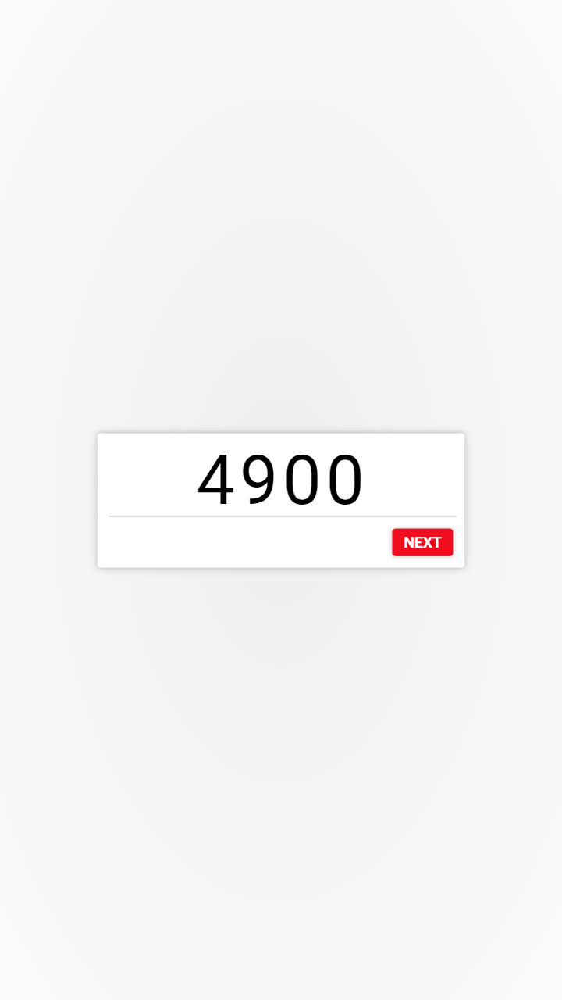

*As of 2022-07-06, I have no intention to bring this project back to the limelight. I designed Bring Back Buffets to address buffet closures dring Covid closures in early 2021. This was before vaccines were available. Though the codebase was complete enough to work somewhere between a development and a production environment, I was not successful in advertising to buffet owners.*

<h1 align="center">Let's "Bring Buffets Back to Business" with an in-house mobile ordering solution!</h1>

1. Customer(s) request a table and pay up-front.
2. Cashier hands receipt to customers(s) with an order code and table number.
3. Customer(s) place their buffet orders on their mobile devices.
4. A server will make the requested order and bring it to the table.

## Screenshots

### localhost:3000/cashier

<p align="center">
  
</p>

### localhost:3000/menu

<p align="center">
  
  
  
  
  
  
  
</p>

### localhost:3000/display

<p align="center">
  
</p>

## Files to Configure

### `./tble.csv`

The program automatically determines how many tables to have the system manage. The `tble` column shows what to name each table for the cashier's view. The `code` field contains the unique access code for each table and should be entered by the customer. The `time` field shows a Unix timestamp for when that table was released.

```csv
tble,code,time
1,4900,1614589670430
2,,
3,,
4,,
5,,
6,,
7,,
8,,
9,,
10,,
11,,
12,,
```

### `./menu.csv`

The `name` column is the name of each food item as viewed by the customer. The `shortname` field is shown in the expedite page and shouldn't be more than 8 characters long. The `limit` field, if not left blank, dictates an upper limit to the number of servings customers can request per visit to the customer page.

```csv
name,shortname,limit,unit,image
Orange Chicken,ORNGCHKN,,sp.,https://farm5.staticflickr.com/4015/4655017334_45f4fffb54_z.jpg
Broccoli Beef,BROCBEEF,,sp.,https://www.itsmydish.com/wp-content/uploads/2015/12/broccoli-beef-final2.jpg
Fried Squid,FRDSQUID,,sp.,https://farm3.staticflickr.com/2669/4189339625_93029fa024_z.jpg
Cheese Wontons,CHZWNTON,,sp.,http://2.bp.blogspot.com/-W-c9y2E3c9E/UCBq6mrCnHI/AAAAAAAAD9A/f7fqM7L2YgA/w1200-h630-p-k-no-nu/IMG_3133.JPG
Sesame Balls,SESAMEBL,,sp.,http://2.bp.blogspot.com/_tbCqVl2yqf8/Sdfjr2TFUGI/AAAAAAAAAcg/D8DRET6u7wI/w1200-h630-p-k-no-nu/sesame+balls+003-2.jpg
```
